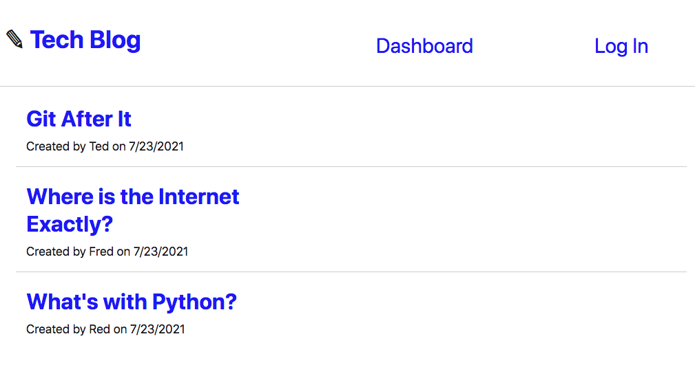

# tech-blog
creates user profile. captures blog and comment events

## Table of Contents

  - [Description](#description)
  - [Installation](#installation)
  - [Usage](#usage)
  - [Contributing](#contributing)
  - [License](#license)
  - [Tests](#tests)
  - [Questions](#questions)
  - [Screenshot](#screenshots)

  ## Description

  What is this app and what does it do:

  This app is designed for a user who wants to a capture a user's signup/login information when they desire to post, edit, or delete a blog and/or leave comments on pre-existing blogs.
  
  Technologies used: Javascript, Node, MySQL, mysql2, sequelize, express, dotenv, etc (all relevent MVC npm packages; see package.json file for complete list).

  * To see the app in action, check out the deployed app on Heroku here >> https://aqueous-taiga-82354.herokuapp.com/

  ## Installation

  To install npm dependencies (dotenv, mysql2, sequelize, express, etc), please use this command >> npm install

  After doing a git clone and installing, drop the schema.sql into MySQL, create a dotenv w/specified fields as shown in the .env.EXAMPLE, and add whichever files you'd like into gitignore before pushing to GitHub. 

  ## Usage

  Here's the essentials for what you need to know to use this app: 

  Once the user hits the landing page, she/he sees the option to go to a dashboard page, log in page, or view the current blogs on the Tech Blog. When the user clicks on a blog, they're able to view the individual blog and if logged in they can leave a comment. If the user has not signed up or logged in, she/he can do so by entering their name, email, and a password. Once they log in, the user can start creating, updating, and deleting blogs. Once the user is satisfied with their blog portfolio they can terminate the session and leave the page. The user is then able to return at any time to start a fresh new blog. 

  ## Contributing

  To contribute to this app, please follow these instructions: 
  
  Please add descriptive commit messages and comments. Remember to do a npm install for relevant dependencies and other packages that you desire. Create a .gitignore for the node_modules, .env, and package-lock.json folder if/when pushing to GitHub.

  ## License
  
 

  ## Tests

  * No tests were developed. 
  
  ## Questions

  * If you have any questions/concerns regarding the app, please contact me on GitHub here (see portfolio app for contact info): https://github.com/tedheikkila

## Screenshots

  * homepage

  

   * one blog w/comment option

  

   * sign up option

  

  * created page for user

  

  * log in option

  

  * user's dashboard w/blogs

  

